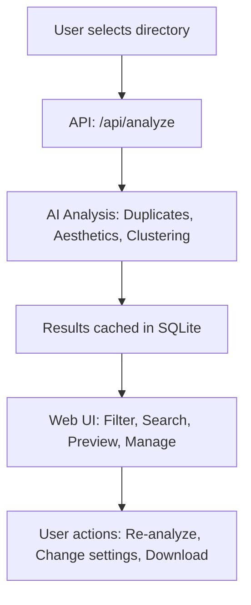

# 🎨 Wallyzer – Project Summary

## Introduction

**Wallpaper Analyzer** is an advanced, AI-powered tool for organizing, analyzing, and optimizing large wallpaper or image collections. It leverages state-of-the-art computer vision and deep learning to automate duplicate detection, aesthetic scoring, and image clustering—all accessible through a modern, real-time web interface.

---

## Key Features

- 🧠 **Smart Duplicate Detection:** Finds visually similar or duplicate images using perceptual hashing and deep learning (MobileNetV2 features).
- 🌟 **Aesthetic Scoring:** AI models (ResNet18) rate images for visual appeal, helping you surface your best wallpapers.
- 🗂️ **Image Clustering:** Groups similar wallpapers using K-means clustering on deep features (ResNet50).
- ⚡ **High Performance:** Optimized for CPU, CUDA, and Apple Silicon (MPS) for fast, scalable analysis.
- 🌐 **Real-time Web Interface:** Responsive, beautiful UI with live progress updates via WebSocket.
- 💾 **Result Caching:** Uses SQLite to cache analysis results for instant repeated access.
- 🔄 **Batch & Recursive Processing:** Efficiently processes large collections, including subdirectories.
- 🔧 **Configurable:** Fine-tune thresholds, batch size, device selection, and more.

---

## How It Works: Workflow

1. **User selects a directory** via the web UI.
2. **Backend analyzes images:**
   - Detects duplicates (hashing + deep features)
   - Scores aesthetics (ResNet-based model)
   - Clusters images (K-means on ResNet50 features)
3. **Results are cached** in SQLite for fast repeated access.
4. **Frontend displays results** with filtering, searching, and cluster navigation.
5. **User can re-analyze** with new settings or export results.

---

## Technical & Architectural Insights

- **Backend:** Python 3.8+, Flask, Flask-SocketIO
- **AI/ML:** PyTorch, torchvision, MobileNetV2 (duplicate detection), ResNet18 (aesthetic scoring), ResNet50 (clustering)
- **Image Processing:** OpenCV, Pillow, scikit-image
- **Data Processing:** NumPy, SciPy, scikit-learn
- **Database:** SQLite for result caching
- **Frontend:** HTML, JavaScript, DaisyUI, Tailwind CSS
- **Real-time Communication:** WebSockets (Flask-SocketIO, eventlet)
- **Batch Processing:** Efficient, multi-threaded, device-aware (CPU/CUDA/MPS)
- **Caching:** Parameter-aware, directory-aware, and content-aware caching for instant repeated analysis

---

## Unique Selling Points

- Handles thousands of images with ease—scalable and robust.
- No manual sorting—AI does the heavy lifting.
- Real-time feedback and beautiful, modern UI.
- Works on all major platforms (Windows, macOS, Linux, FreeBSD).
- Highly configurable for power users and researchers.
- Open source and extensible.

---

## What I Learned

- Building an end-to-end AI application (from model selection to web deployment)
- Optimizing performance for large datasets and heterogeneous hardware
- Creating user-friendly, real-time web interfaces
- Managing and caching results efficiently for a smooth user experience
- Integrating deep learning, clustering, and perceptual hashing in a production workflow

---

## Future Improvements

- Add support for more image formats and video thumbnails
- Integrate cloud storage (Google Drive, Dropbox, etc.)
- Add user authentication and multi-user support
- Provide export options (CSV, JSON, ZIP)
- Enhance clustering with self-supervised or transformer-based models
- Add more visualization and management tools in the UI

---
